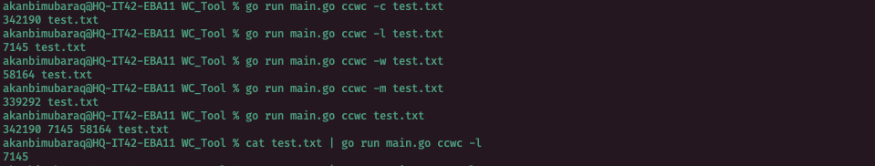

A WC Tool implementation in Golang from [John Cricket coding challenges](https://codingchallenges.fyi/challenges/challenge-wc)

# WC Tool implementation in Golang


A simple implementation of a WC tool written in Golang.
Part of my attempt at John Crickett's [Coding Chanllenges](https://codingchallenges.fyi/challenges/challenge-wc)

## Features

- Basic implementation of WC tool functionality.
- Support for the Standard Input protocol.
- Support for common WC commands.

## Installation

1. Clone the repository:

   ```bash
   git clone https://github.com/olartbaraq/WC_Tool.git
   cd WC_Tool
   ```

## Usage

1. Run the WC Tool :

   ```bash
   go run main.go ccwc [options] [filename]
   ```

## Supported Commands

- `-c`: number of bytes in a file.
- `-l`: number of lines in a file.
- `-w`: words in a file.
- `-m`: number of characters in a file.
- `no options are provided`: equivalent to the -c, -l and -w options.
- `read from standard input if no filename is specified`

## Basic example


